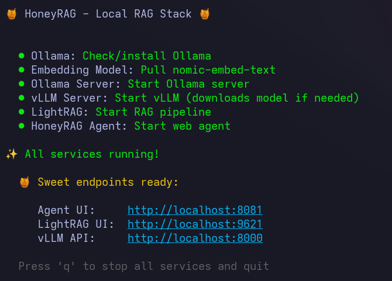

# 🍯 HoneyRAG

**A sweet, fully-integrated local RAG stack.**

One command. Full RAG pipeline. No cloud. No API keys. Just pure local AI goodness.




---

## What's in the Stack?

| Service | Purpose | Port |
|---------|---------|------|
| **Ollama** | Embedding generation (nomic-embed-text) | 11434 |
| **vLLM** | Local LLM inference (Qwen3-8B) | 8000 |
| **LightRAG** | RAG pipeline (chunking, indexing, retrieval) | 9621 |
| **Agno Agent** | Web UI + Agent framework | 8081 |

All services talk to each other. Upload documents to LightRAG, query through Agno. Simple.

---

## Quick Start

### Prerequisites

- **GPU**: NVIDIA with 16GB+ VRAM (RTX 3090, 4080, 4090, etc.)
- **CUDA**: 12.0+
- **Python**: 3.11+
- **Go**: 1.22+ (for building the TUI)
- **uv**: Python package manager ([install](https://docs.astral.sh/uv/getting-started/installation/))

### Install

```bash
# Clone the repo
git clone https://github.com/maxazure/honeyrag.git
cd honeyrag

# Run the setup script
./scripts/install.sh
```

### Run

```bash
./honeyrag
```

That's it. The TUI will:
1. ✅ Check/install Ollama (if not installed)
2. ✅ Pull embedding model (if not downloaded)
3. ✅ Start Ollama server
4. ✅ Start vLLM server (downloads LLM on first run)
5. ✅ Start LightRAG
6. ✅ Start HoneyRAG Agent

First run takes longer (model downloads). Subsequent runs are fast.

---

## What You Get

Once running, you have:

- **http://localhost:8081** — Agent Web UI (chat with your documents)
- **http://localhost:9621** — LightRAG UI (upload & manage documents)
- **http://localhost:8000/docs** — vLLM API docs

### Workflow

1. Open LightRAG UI (port 9621)
2. Upload your PDFs/documents
3. Open Agent UI (port 8081)
4. Ask questions about your documents
5. Get accurate, referenced answers

---

## Configuration

Edit `configs/.env` to customize:

```env
# Use a different model (must fit in VRAM)
VLLM_MODEL=Qwen/Qwen2.5-7B-Instruct

# Adjust for your GPU
VLLM_GPU_MEMORY_UTILIZATION=0.8
VLLM_MAX_MODEL_LEN=8192

# Change ports if needed
VLLM_PORT=8000
LIGHTRAG_PORT=9621
AGNO_PORT=8081
```

### Model Options by VRAM

| VRAM | Recommended Model | Context |
|------|-------------------|---------|
| 8GB | Qwen/Qwen2.5-3B-Instruct | 4096 |
| 16GB | Qwen/Qwen3-8B | 8192 |
| 24GB | Qwen/Qwen2.5-14B-Instruct | 8192 |

---

## Project Structure

```
honeyrag/
├── cmd/honeyrag/        # Go TUI application
├── configs/             # Configuration files
├── services/
│   ├── lightrag/        # LightRAG service
│   └── agno/            # Agno agent service
├── scripts/             # Setup scripts
└── README.md
```

---

## Building from Source

```bash
# Install Go dependencies
go mod tidy

# Build the binary
go build -o honeyrag ./cmd/honeyrag

# Run it
./honeyrag
```

---

## Stopping Services

Press `q` in the TUI, or:

```bash
# Stop all HoneyRAG services
pkill -f "ollama serve"
pkill -f "vllm serve"
pkill -f "lightrag-server"
pkill -f "uvicorn app:app"
```

---

## Why "HoneyRAG"?

Because good things are sweet, and this stack just works. 🍯

---

## Troubleshooting

### vLLM takes forever to start
First run downloads the model (~16GB for Qwen3-8B). Be patient.

### Out of VRAM
Edit `configs/.env` and use a smaller model or reduce `VLLM_GPU_MEMORY_UTILIZATION`.

### Port already in use
Change ports in `configs/.env` or kill the existing process.

---

## Contributing

PRs welcome! Please open an issue first to discuss what you'd like to change.

---

## License

MIT License - do whatever you want with it.

---

## Acknowledgments

Built with:
- [vLLM](https://github.com/vllm-project/vllm) - Fast LLM inference
- [Ollama](https://ollama.ai) - Local embeddings
- [LightRAG](https://github.com/HKUDS/LightRAG) - Simple RAG pipeline
- [Agno](https://github.com/agno-agi/agno) - Agent framework
- [Bubble Tea](https://github.com/charmbracelet/bubbletea) - Beautiful TUI

---

*Made with 💜 *
